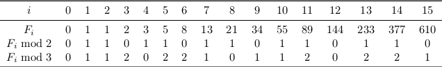

## Fibonacci Number Again

#### Task:
    
    Given two integers n and m, output F n mod m (that is, the remainder of F n when divided by m).
In this problem, your goal is to compute F n modulo m, where n may be really huge: up to 10 18 . For such
values of n, an algorithm looping for n iterations will not fit into one second for sure. Therefore we need to
avoid such a loop.
To get an idea how to solve this problem without going through all F i for i from 0 to n, let’s see what
happens when m is small — say, m = 2 or m = 3.

Take a detailed look at this table. Do you see? Both these sequences are periodic! For m = 2, the period
is 011 and has length 3, while for m = 3 the period is 01120221 and has length 8. Therefore, to compute,
say, F 2015 mod 3 we just need to find the remainder of 2015 when divided by 8. Since 2015 = 251 · 8 + 7, we
conclude that F 2015 mod 3 = F 7 mod 3 = 1.
This is true in general: for any integer m ≥ 2, the sequence F n mod m is periodic. The period always
starts with 01 and is known as **Pisano** period.
#### Input format: 
    The input consists of two integers n and m given on the same line (separated by a space).
#### Output format:
    Output Fn mod m.
#### Constraints:
    1 ≤ n ≤ 10^18, 2 ≤ m ≤ 10^3.

---

#### Sample 1
   Input:
   
    239 1000
    
   Output:
   
    161
F 239 mod 1 000 = 39 679 027 332 006 820 581 608 740 953 902 289 877 834 488 152 161 (mod 1 000) = 161.
#### Sample 1
   Input:
   
    2816213588 239
    
   Output:
   
    151
F 2 816 213 588 does not fit into one page of this file, but F 2 816 213 588 mod 239 = 151.
   